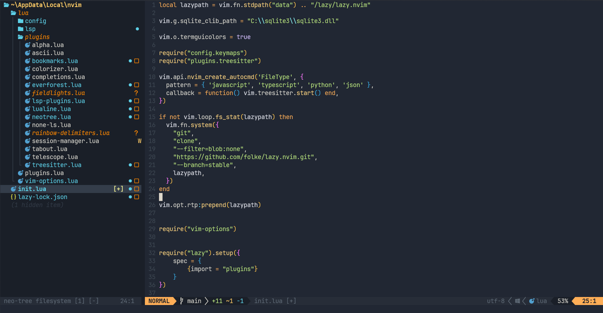

# fieldlights.nvim


A Neovim port of the **Field Lights** VSCode color theme.

## Screenshot



## Installation

### Using lazy.nvim

```lua
{
  "waytoopurple/fieldlights.nvim",
  lazy = true,
  config = function()
    require("fieldlights").setup()
  end
}
```

### Using packer.nvim
```lua
use {
  "waytoopurple/fieldlights.nvim",
  config = function()
    require("fieldlights").setup()
  end
}
```

### Manual
```lua
require("fieldlights").setup()
```

## Configuration

### Lualine
To enable the Field Lights theme for LuaLine, you can specify it as such:
```lua
require('lualine').setup({
    options = {
        -- ... other configuration
        theme =  require("fieldlights.lualine")
    }
})
```

### Rainbow Delimiters
In order to get enable alternating parentheses, you should configure rainbow-delimiters.nvim it as such:
```lua
require("rainbow-delimiters.setup").setup({
    -- recomended in order match the original theme
    blacklist = {
				"html",
			},
    highlight = {
        "RainbowDelimiterRed",
        "RainbowDelimiterYellow",
        "RainbowDelimiterBlue",
        "RainbowDelimiterOrange",
        "RainbowDelimiterGreen",
        "RainbowDelimiterViolet",
    }
})
```

## Contributing
Contributions are very welcome!

Porting and maintaining highlights for many plugins and programming languages takes a significant amount of time, and community support helps a lot. If you notice missing highlights, inconsistencies, or want to improve existing integrations, feel free to open a pull request.

### Guidelines
- Keep changes focused and minimal.
- Follow the existing project structure and naming conventions.
- Test you changes with the relevant language or plugin before submitting.

### Commit Messages
All commits must follow the **Conventional Commits** specification:
- Use the conventional commit format.
- Write commit messages in **present tense**.
- Keep them concise and descriptive.

Thank you for helping improve the project!

## Credits

- [Field Lights](https://github.com/sveggiani/vscode-field-lights)
